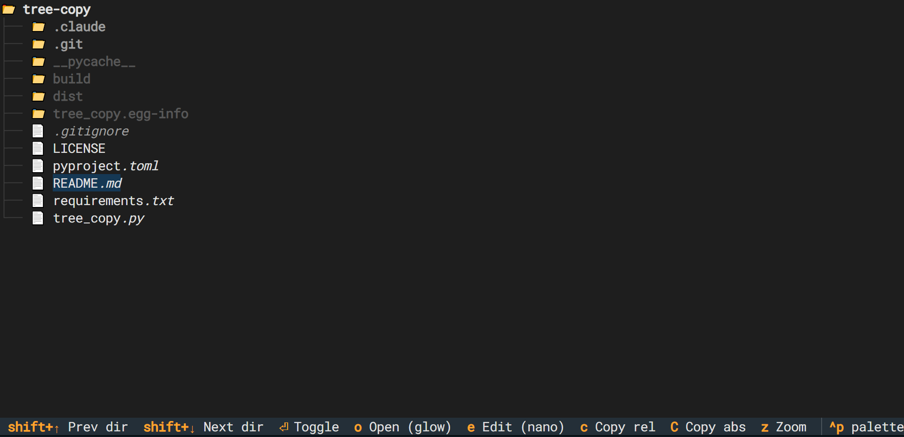

# tree-copy



[](https://pypi.org/project/tree-copy/)
[](https://pypi.org/project/tree-copy/)
[](LICENSE)
[](https://pypi.org/project/tree-copy/)

A keyboard-driven file tree sidebar for tmux, built with [Textual](https://github.com/Textualize/textual).

Browse your project, jump between directories, copy paths, and preview files — without leaving the terminal.

**[PyPI](https://pypi.org/project/tree-copy/) · [GitHub](https://github.com/tzafrir/tree-copy)**

## Features

- Navigate the file tree with arrow keys
- Jump between sibling directories with `Shift+↑/↓`
- Copy relative or absolute paths to clipboard
- Preview files with [glow](https://github.com/charmbracelet/glow) (falls back to `less`)
- Edit files with `$TREE_COPY_EDITOR` (falls back to nano → vi)
- Root folder stays open (non-collapsible)

## Requirements

- Python 3.10+
- [glow](https://github.com/charmbracelet/glow) *(optional, recommended for file preview — falls back to `less`)*

## Install

```bash
pip install tree-copy
```

Or from source:

```bash
pip install .
```

## Usage

```bash
tree-copy [directory]   # defaults to current directory
```

As a togglable tmux sidebar, add to `~/.tmux.conf`:

```bash
bind-key e run-shell " \
  PANE=$(tmux show-option -wqv @tree-copy-pane); \
  if [ -n \"$PANE\" ] && tmux list-panes -F '#{pane_id}' | grep -q \"^$PANE\$\"; then \
    tmux kill-pane -t \"$PANE\"; \
    tmux set-option -w @tree-copy-pane ''; \
  else \
    NEW_PANE=$(tmux split-window -hbP -l 35 -F '#{pane_id}' \"tree-copy '#{pane_current_path}'\"); \
    tmux set-option -w @tree-copy-pane \"$NEW_PANE\"; \
  fi"
```

`prefix + e` opens the sidebar; pressing it again closes it. State (expanded folders, cursor position) is saved automatically and restored on next open.


## Keybindings

| Key | Action |
|-----|--------|
| `↑` / `↓` | Navigate |
| `Shift+↑` / `Shift+↓` | Jump between sibling directories; moves to parent at bounds |
| `Enter` / `Space` | Toggle directory open/close |
| `o` | Preview file (glow if available, else less) |
| `e` | Edit file (`$TREE_COPY_EDITOR`, else nano, else vi) |
| `c` | Copy relative path to clipboard |
| `C` | Copy absolute path to clipboard |
| `q` / `Esc` | Quit |

## License

[MIT](LICENSE)
